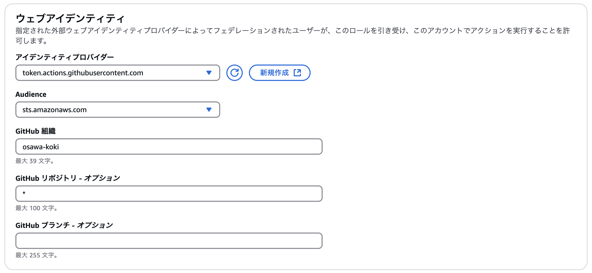

# oidc-integration-github-aws

👺👺👺 OIDCを利用してGitHubとAWSの連携して、GitHub ActionsでAWSのリソースを操作してみる！  

## デプロイ

.env.exampleをコピーして.envを作成してください。  
中身は適切に設定してください。  

DevContainerに入ってから以下のコマンドで、CloudFormationテンプレートをデプロイします。  
※ ~/.aws/credentialsに適切なAWSの認証情報が設定されていることを前提としています。  

```bash
source .env

aws cloudformation deploy \
  --template-file ./template.yml \
  --stack-name oidc-integration-github-aws \
  --capabilities CAPABILITY_NAMED_IAM \
  --parameter-overrides GitHubUser=${GITHUB_USER}
```

各種パラメタは以下のコマンドで取得できます。  

```bash
source .env

aws cloudformation describe-stacks \
  --stack-name ${STACK_NAME} \
  --query 'Stacks[0].Outputs[*].{Key:OutputKey,Value:OutputValue}' \
  --output table
```

試しに、GitHub Actionsを実行してみましょう。  
以下のシークレットをGitHubのリポジトリに設定してください。  

| シークレット名 | 値 |
| --- | --- |
| AWS_ROLE_ARN | `GitHubOIDCRoleArn`の値 |

## おおさわメモ

GUIでこれらのリソースを作成する場合のメモです！  

### 1. IDプロバイダーの作成

「IAM」ページの「ID プロバイダ」メニューから、「プロバイダを追加」をクリックします。  

  

「プロバイダのタイプ」で「OpenID Connect」を選択します。  
その他の項目は以下の通りです。  

| 項目 | 値 |
| --- | --- |
| プロバイダのURL | `https://token.actions.githubusercontent.com` |
| 対象者 | `sts.amazonaws.com` |

  

その他の項目はデフォルトのままでOKです。  
そのまま作成します。  

一覧画面に戻ると、作成したIDプロバイダーが表示されていることが確認できます。  

  

### 2. ロールの作成

「IAM」ページの「ロール」メニューから、「ロールを作成」をクリックします。  

  

「信頼されたエンティティタイプ」で「ウェブアイデンティティ」を選択します。  

  

ウェブアイデンティティの詳細設計は以下の通りに設定します。  

| 項目 | 値 |
| --- | --- |
| アイデンティティプロバイダー | `tokens.actions.githubusercontent.com` |
| Audience | `sts.amazonaws.com` |
| GitHub 組織 | GitHubのユーザー名または組織名 |
| GitHub リポジトリ | GitHubのリポジトリ名 |
| GitHub ブランチ | GitHubのブランチ名 |

  

次に、このロールに割り当てるポリシーを設定します。  

  

最後に名前を設定して、ロールを作成します。  
その他のステップ項目はすでに設定されているので、そのままでOKです。  

  

一覧画面に戻ると、作成したロールが表示されていることが確認できます。  

  

作成したロールのARNをメモしておきます。  
これをGitHub Actionsのシークレットに設定して使用します。  
